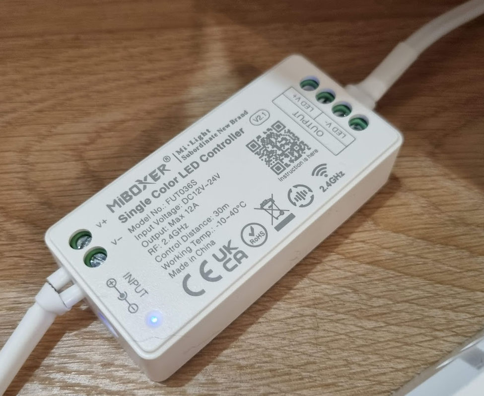
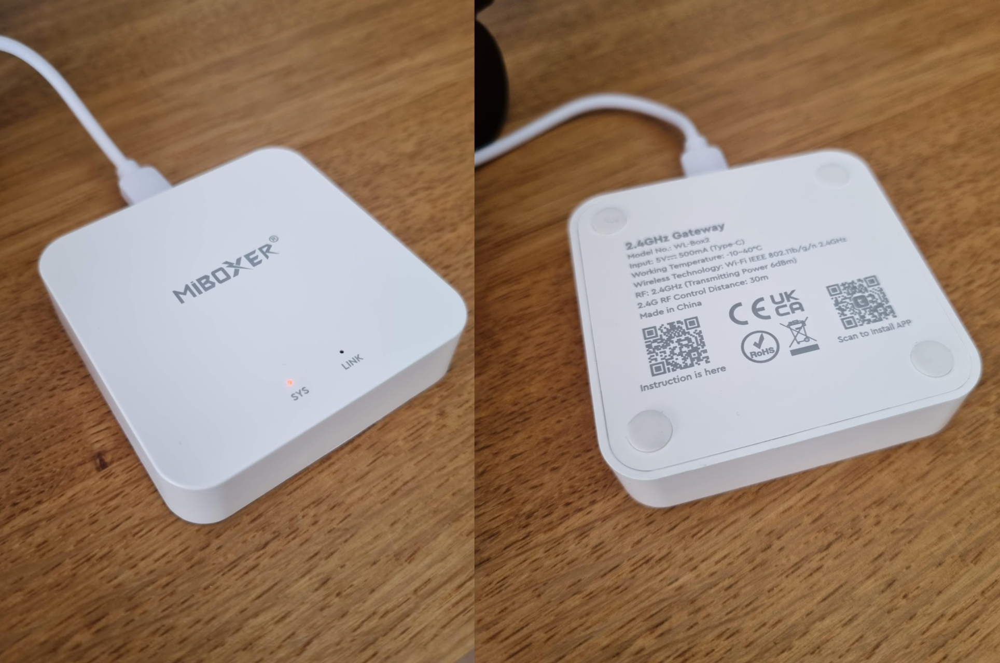
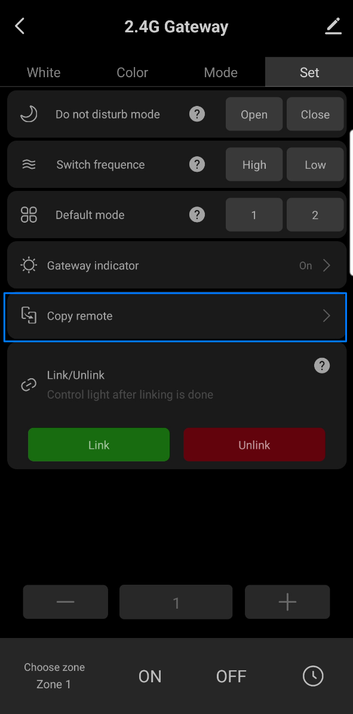
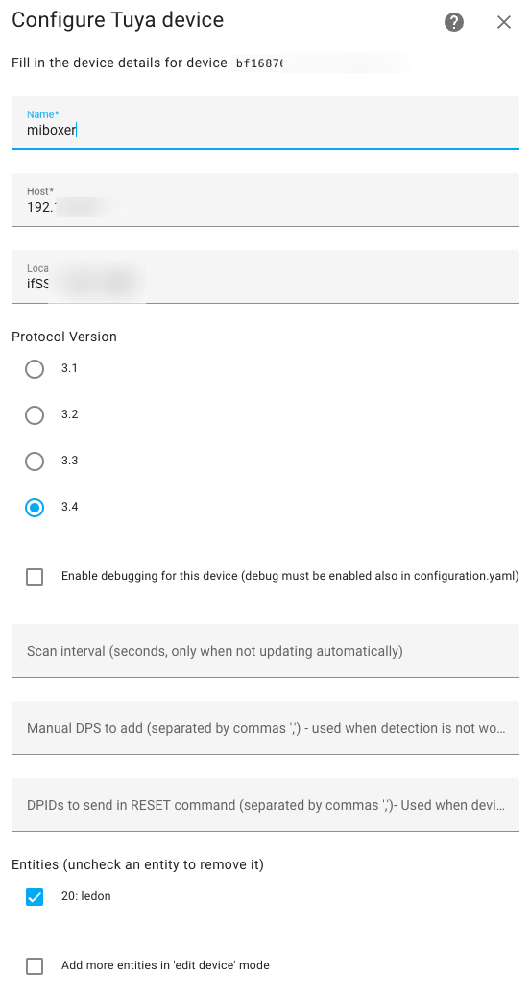
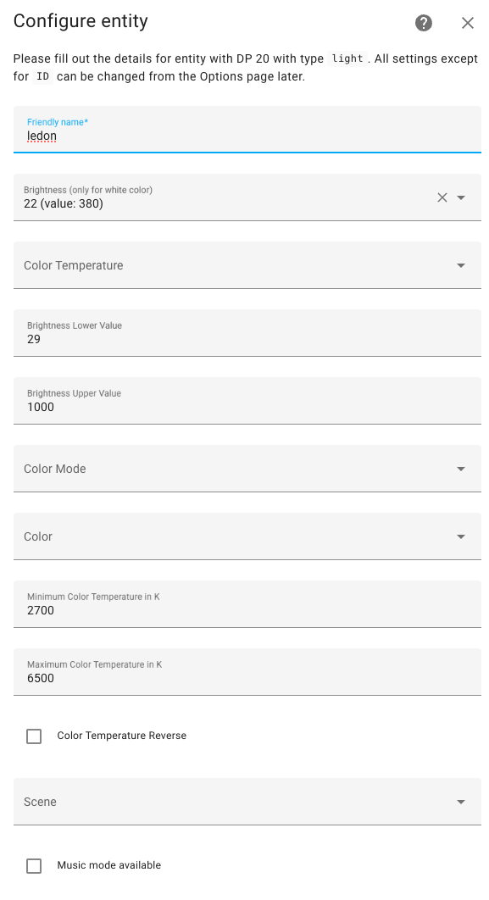

# MiBoxer WL-Box2 + FUT007 + Home Assistant
This is one way to setup the MiLight controller to Home Assistant. It worked for me.

# Requirements
- MiLight / MiBoxer LED controller 
- FUT007 remote
- MiBoxer hub (WL-Box2)
- [LocalTuya](https://github.com/rospogrigio/localtuya/) configured in Home Assistant
- Smart Life / Tuya app 

| Controller                               | Hub                                         |
| ---------------------------------------- | ------------------------------------------- |
|  |  |

# Steps
1. Pair your remote with controller as [per manual](https://milight.pro/manuals/FUT007_EN.pdf)
2. Pair your MiBoxer hub with Tuya app and add it to your local wi-fi network
3. Copy the remote in Tuya app (see the screenshot)
   
4. After the remote has been added, test if you can control the LED controller via the Tuya app
5. Make sure you have LocalTuya integrated in Home Assistant
6. Add new Tuya device. In my case the local key got filled automatically.
7. Add new entity as light, see the screenshot below for configuration that works with dimmer
8. After that I blocked the MiBoxer hub from Internet access using my router traffic settings, the SYS status light turned red indicating no cloud connection

| Adding hub                | Adding light                |
| ------------------------- | --------------------------- |
|  |  |
 

